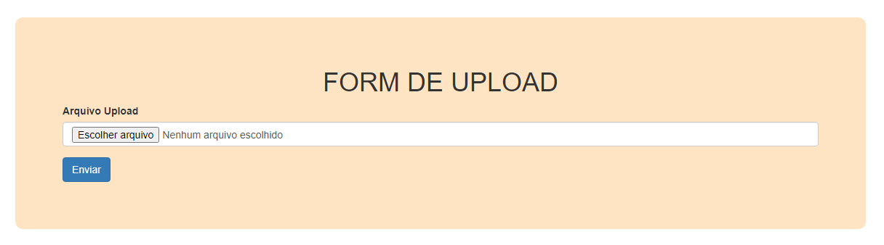

#  Upload Arquivo com Multer

Nessa mini projeto, fiz um formulário para upload de arquivos. Usando a dependencia `MULTER` e `EXPREESS`.

Foi desenvolvido em `JavaScript` e para criar o fomulário, usei a `ENGINE` `EJS`.

Para criar o Front-End 

### Dependência.

```
"dependencies": {
    "ejs": "^3.1.8",
    "express": "^4.18.1",
    "multer": "^1.4.5-lts.1"
}
```

# ScreenShot

## --
<p align="center">

</p>


<h1 align="center">💻 Desenvolvido Por: Gilberto Júnior</h1>